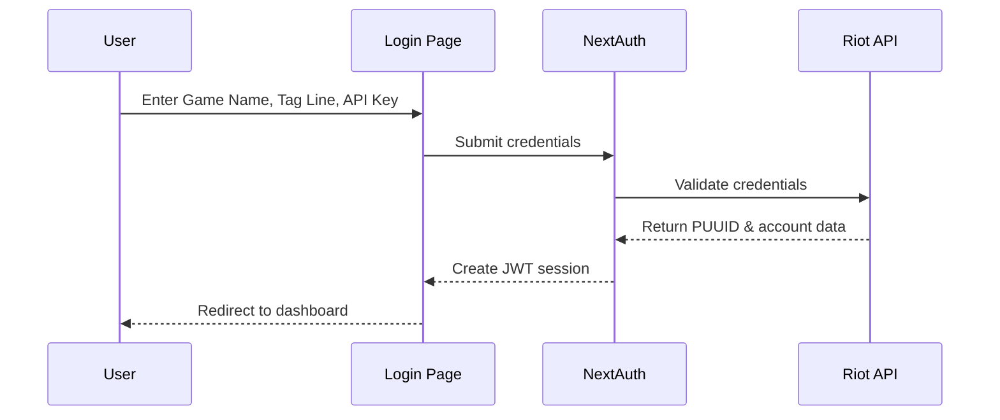

Agent LoL uses [NextAuth.js v5](https://authjs.dev/) with a custom Credentials provider to authenticate users directly against the Riot Games API. This approach ensures that only valid Riot accounts with proper API keys can access the application.

## Authentication Flow

The authentication system validates user credentials by making a direct API call to Riot's account lookup endpoint:



<Steps>

### User Submits Credentials

Users provide three pieces of information on the login page:

- **Game Name**: Riot ID name (e.g., `Faker`)
- **Tag Line**: Riot ID tag without `#` (e.g., `KR1`)
- **API Key**: Valid Riot Games API key from [developer.riotgames.com](https://developer.riotgames.com/)

### Server-Side Validation

NextAuth's `authorize` function validates the input before making any API calls:

```javascript auth.js
function validateCredentials(gameName, tagLine, apiKey) {
  const errors = [];
  const g = typeof gameName === 'string' ? gameName.trim() : '';
  const t = typeof tagLine === 'string' ? tagLine.replace(/^#/, '').trim() : '';
  const k = typeof apiKey === 'string' ? apiKey.trim() : '';
  
  if (!g || g.length < 2) errors.push('Game Name must be at least 2 characters');
  if (!t) errors.push('Tag Line is required');
  if (!k) errors.push('API Key is required');
  
  return { gameName: g, tagLine: t, apiKey: k, errors };
}
```

This normalization ensures:
- Tag lines with `#` prefixes are stripped
- All inputs are trimmed of whitespace
- Minimum length requirements are enforced

### Riot API Verification

The API key and Riot ID are validated by calling Riot's account lookup endpoint:

```javascript auth.js
const RIOT_ACCOUNT_URL = (gameName, tagLine) =>
  `https://americas.api.riotgames.com/riot/account/v1/accounts/by-riot-id/${encodeURIComponent(gameName)}/${encodeURIComponent(tagLine)}`;

const response = await fetch(url, {
  headers: { 'X-Riot-Token': apiKey },
  cache: 'no-store',
});
```

The authentication succeeds only if:
1. The API key is valid and not expired
2. The Riot ID (Game Name + Tag Line) exists
3. Riot API returns a valid PUUID

### Error Handling

The system provides specific error messages for different failure scenarios:

```javascript auth.js
if (!response.ok) {
  if (response.status === 401) {
    throw new Error('Invalid API key or Riot account.');
  }
  if (response.status === 403) {
    throw new Error('API key forbidden or rate limited.');
  }
  if (response.status === 404) {
    throw new Error('Riot ID not found. Check Game Name and Tag Line.');
  }
  if (response.status === 429) {
    throw new Error('Too many requests. Please try again later.');
  }
  throw new Error(data?.status?.message || `Riot API error (${response.status}).`);
}
```

</Steps>

## Session Management

Agent LoL uses **JWT-based sessions** for stateless authentication. This approach is ideal for serverless deployments and doesn't require a database.

### Session Configuration

```javascript auth.js
session: {
  strategy: 'jwt',
  maxAge: 30 * 24 * 60 * 60, // 30 days
  updateAge: 24 * 60 * 60,    // update session every 24h
}
```

- **Sessions last 30 days** before requiring re-authentication
- **Session tokens are updated every 24 hours** to maintain freshness
- **JWT tokens are encrypted** using the `AUTH_SECRET` environment variable

### JWT Token Structure

The JWT token stores user data and the API key securely:

```javascript auth.js
async jwt({ token, user }) {
  if (user) {
    token.puuid = user.puuid;
    token.gameName = user.gameName;
    token.tagLine = user.tagLine;
    token.apiKey = user.apiKey;  // Stored in JWT, never in session
  }
  return token;
}
```

<Warning>
The API key is stored in the encrypted JWT but is **never exposed to the client** through the session object.
</Warning>

### Session Callback

The session callback determines what data is exposed to the client:

```javascript auth.js
async session({ session, token }) {
  if (session.user) {
    session.user.puuid = token.puuid;
    session.user.gameName = token.gameName;
    session.user.tagLine = token.tagLine;
    // apiKey is intentionally NOT exposed to the client
  }
  return session;
}
```

Client-side code can access:
- `session.user.puuid` - Unique player identifier
- `session.user.gameName` - Display name
- `session.user.tagLine` - Tag identifier

The API key remains server-side only and is used for backend API calls.

## Protected Routes

Pages are protected using the `auth()` helper from NextAuth:

```javascript src/app/page.js
import { redirect } from 'next/navigation';
import { auth } from 'auth';

export default async function Home() {
  const session = await auth();
  if (!session?.user) {
    redirect('/login?callbackUrl=/');
  }
  
  return <HomeContent user={session.user} />;
}
```

This server-side check ensures:
- Unauthenticated users are redirected to `/login`
- The `callbackUrl` parameter preserves the intended destination
- Session data is available in server components

## Client-Side Authentication

The login page uses React's `useActionState` for form handling:

```javascript src/app/login/page.js
import { signIn } from 'next-auth/react';

async function signInAction(prevState, formData) {
  const gameName = getFormString(formData, 'gameName');
  const tagLine = getFormString(formData, 'tagLine').replace(/^#/, '');
  const apiKey = getFormString(formData, 'apiKey');
  
  const result = await signIn('riot-credentials', {
    gameName,
    tagLine,
    apiKey,
    redirect: false,
  });
  
  if (result?.ok) {
    router.push(redirectTo);
    router.refresh();
  }
}
```

Key features:
- **Progressive enhancement** - Works without JavaScript
- **Client-side validation** before server submission
- **Error feedback** displayed directly in the form
- **No full page refresh** for better UX

## Security Best Practices

<Note>
Agent LoL implements several security measures to protect user credentials:
</Note>

### 1. API Key Storage

- API keys are **never exposed to the browser**
- Stored only in encrypted JWT tokens
- Used exclusively in server-side API routes

```javascript
// ✅ Good: Server-side only
const session = await auth();
const token = await getToken({ req });
const apiKey = token.apiKey; // Only available on server

// ❌ Bad: Never do this
const apiKey = session.user.apiKey; // undefined on client
```

### 2. Session Encryption

Generate a strong `AUTH_SECRET` for production:

```bash
npx auth secret
```

This secret:
- Encrypts all JWT session tokens
- Should be at least 32 characters
- Must be kept secure and never committed to version control

### 3. Rate Limiting

Riot API keys have built-in rate limits:
- **Development keys**: 20 requests/second, 100 requests/2 minutes
- **Production keys**: Higher limits based on approval

The authentication flow handles rate limit errors gracefully:

```javascript
if (response.status === 429) {
  throw new Error('Too many requests. Please try again later.');
}
```

### 4. HTTPS Only

<Warning>
Always use HTTPS in production to protect credentials in transit.
</Warning>

NextAuth automatically sets secure cookie flags when:
- `NODE_ENV === 'production'`
- The site is accessed via HTTPS

### 5. No Database Required

By using JWT sessions:
- No sensitive data is stored in a database
- Reduces attack surface
- Simplifies deployment and scaling

## Environment Variables

Required environment variables for authentication:

```bash .env.local
# Required: Session cookie encryption
AUTH_SECRET=your-generated-secret

# Required: Riot API credentials
API_KEY=RGAPI-your-api-key
GAME_NAME=YourGameName
TAG_LINE=1234
```

<Tip>
The `GAME_NAME` and `TAG_LINE` variables are used as defaults for server-side operations. Users authenticate with their own Riot IDs through the login form.
</Tip>

## Testing Authentication

To test the authentication flow:

1. **Start the development server**:
   ```bash
   npm run dev
   ```

2. **Navigate to the login page**:
   ```
   http://localhost:3000/login
   ```

3. **Test with invalid credentials** to verify error handling:
   - Wrong API key → "Invalid API key or Riot account"
   - Non-existent Riot ID → "Riot ID not found"
   - Empty fields → Client-side validation errors

4. **Test with valid credentials** to confirm successful authentication

## Troubleshooting

### "Invalid API key or Riot account"

**Cause**: The API key is expired, invalid, or doesn't match the Riot account.

**Solution**: Generate a fresh API key from [developer.riotgames.com](https://developer.riotgames.com/).

### Session Cookie Not Set

**Cause**: Missing or invalid `AUTH_SECRET`.

**Solution**: 
```bash
npx auth secret
```
Add the generated secret to `.env.local`.

### "Riot API error (401)"

**Cause**: API key authentication failed.

**Solution**: Verify your API key hasn't expired. Development keys expire every 24 hours.

### "Too many requests"

**Cause**: Rate limit exceeded.

**Solution**: Wait 2 minutes before retrying, or apply for a production API key with higher limits.

## Next Steps

<CardGroup cols={2}>
<Card title="API Integration" icon="plug" href="/api/overview">
  Learn how to use the Riot API with authenticated sessions
</Card>

<Card title="Configuration" icon="gear" href="/configuration/environment">
  Configure environment variables for production deployment
</Card>
</CardGroup>